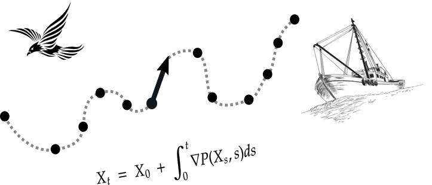

Curso organizado por:

```{r setup, include=FALSE}
options(htmltools.dir.version = FALSE)
```

```{r, out.width = "70%", fig.align='center', echo=FALSE}
# knitr::include_graphics("./img/logo-cientifica.png")
```

---

# Rocío Joo

```{r, out.width = "40%", fig.align='center', echo=FALSE}

```

 * Investigación en estadística aplicada a la ecología y pesquería
 * Científica de datos en Global Fishing Watch
 * Doctorado sobre la modelización de trayectorias de embarcaciones pesqueras (Université de Montpellier, Francia)
 * Master en Matemáticas, Estadística y Aplicaciones (Montpellier SupAgro - Université de Montpellier, Francia)
 * Ingeniería Estadística (Universidad Nacional de Ingeniería, Perú)
 
`r  icons::fontawesome$brands$"twitter-square"`  @rocio_joo

`r  icons::fontawesome("envelope")`  rocio.joo@ufl.edu

https://rociojoo.github.io/

---

# Plan para esta tarde:

* Presentar el espacio zoom

* Visión general del contenido del curso

* Algunos resultados de la encuesta previa

* Presentaciones de participantes

* Práctica de R

---

# Espacio zoom

* Lista de participantes: nombres, manos

* Micrófono, video

* Chat: preguntas, comentarios, ayudas de asistentes

* Compartir pantallas

* Dividir en salas

* Evitar notificaciones de otros aplicativos o dispositivos

---

# Visión general del curso:

--

**1.** Práctica de R: 
  * Ejercicios para que recuerden funciones y cálculos esenciales en R

--

**2.** Introducción al aprendizaje automático: 
  * ¿Qué es? Aprendizaje supervisado. Ejemplos de métodos y aplicación. 
  Performance. Validación.

--

**3.** Aprendizaje automático con tidymodels, gráficos de dependencia parcial e
importancia de variables

--

**4.** Otros aspectos del aprendizaje automático:
  * Aprendizaje automatizado. Sesgos, sobre ajuste, data leakage

! La duración de cada sub-módulo dependerá del avance del grupo

---

# Dinámica general

* Explicaciones de mi parte

* Trabajos personales

* Trabajos en grupos (aleatorios o pre-definidos)

* Formularios y documentos a llenar

* Pausas cada ~40 minutos

* Por favor, hacerme recordar: al final de cada clase, habrá un formulario de salida

* Al principio de las siguientes clases, empezaremos con las dudas que tengan de la clase anterior

* Reglas para las pausas: no dispositivos electrónicos


---

# Encuesta previa

Resultados sobre lo que contestaron. 

---

# Presentaciones

* Les llamaré individualmente

* Presentarán brevemente: 

    * quiénes son 
    
    * su objeto de estudio, qué tipo de datos usan, preguntas, métodos
    
    * porqué y para qué están aquí

