```{r setup, include=FALSE}
options(htmltools.dir.version = FALSE)
```

```{r xaringan-themer, include=FALSE, warning=FALSE}
library(xaringanthemer)
style_mono_accent(
  base_color = "#1c5253",
  header_font_google = google_font("Lato"),
  # text_font_google   = google_font("Montserrat", "300", "300i"),
  # code_font_google   = google_font("Fira Mono")
)
```


# Aprendizaje automático e Inteligencia artificial

--

```{r, out.width = "90%", fig.align='center', echo=FALSE, fig.alt="black box, futurama robot, rabbit in a hat"}
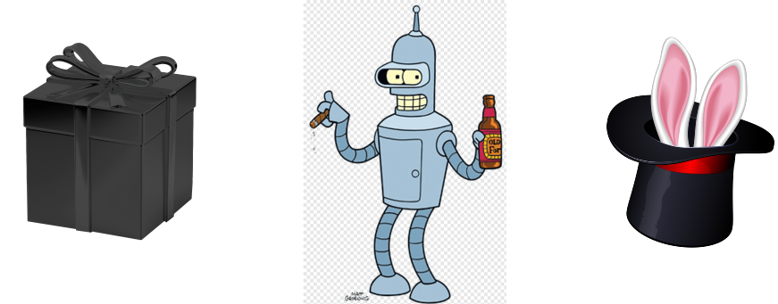
```

.center[Caja negra de tecnología sofisticada + magia]

---

# Aprendizaje automático e Inteligencia artificial

```{r, out.width = "80%", fig.align='center', echo=FALSE, fig.alt="open box"}

```

.center[Abriremos la caja negra]

---

# Aprendizaje automático e Inteligencia artificial

```{r, out.width = "77%", fig.align='center', echo=FALSE, fig.alt = "rabbit magic trick"}
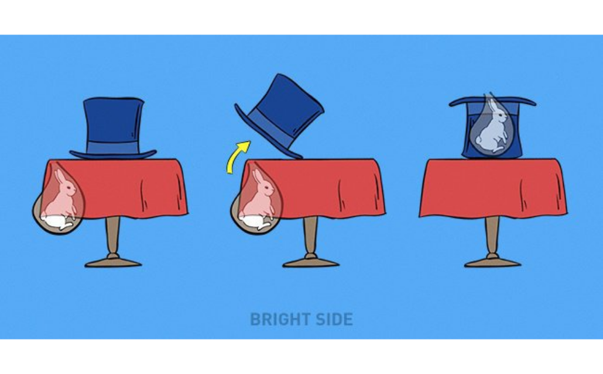
```

.center[Encontraremos algoritmos para optimizar resultados.] 
.center[Y podremos realizar los trucos de magia.]

---

# Aprendizaje automático e Inteligencia artificial

Plan del módulo:

1. Conceptos de aprendizaje automático e inteligencia artificial

--

2. Tipos de aprendizaje automático

--

3. Clasificación y regresión en aprendizaje supervisado

--

4. Árboles de decisión y bosques aleatorios

--

5. Entrenamiento y test

--

6. Medidas de desempeño del modelo

--

7. Herramientas para interpretar el modelo

--

8. Paquetes de R

--

9. Ética


---

# Aprendizaje automático e Inteligencia artificial

```{r, out.width = "80%", fig.align='center', echo=FALSE, fig.alt = "definiciones de AI y ML"}
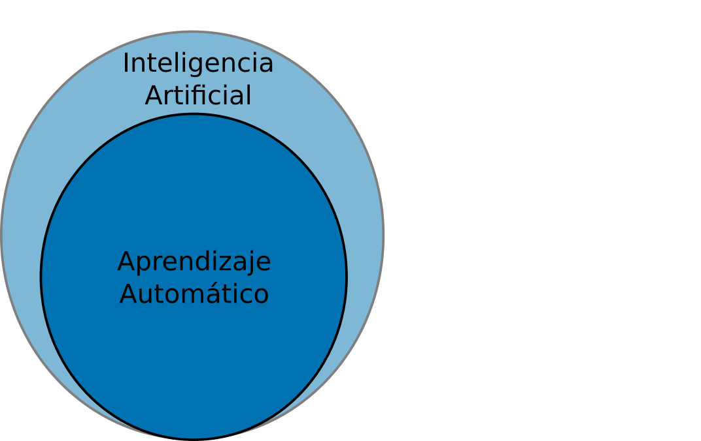
```

Modificado de [https://www.edureka.co/blog/](https://www.edureka.co/blog/ai-vs-machine-learning-vs-deep-learning/)

---

# Aprendizaje automático e Inteligencia artificial

```{r, out.width = "80%", fig.align='center', echo=FALSE, fig.alt = "definiciones de AI y ML"}

```

Modificado de [https://www.edureka.co/blog/](https://www.edureka.co/blog/ai-vs-machine-learning-vs-deep-learning/)

---

# Aprendizaje automático e Inteligencia artificial

```{r, out.width = "80%", fig.align='center', echo=FALSE, fig.alt = "definiciones de AI y ML"}
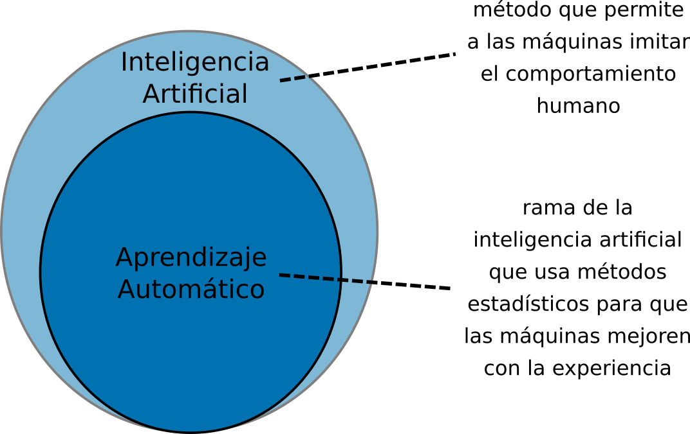
```

Modificado de [https://www.edureka.co/blog/](https://www.edureka.co/blog/ai-vs-machine-learning-vs-deep-learning/)

---

```{r, out.width = "60%", fig.align='center', echo=FALSE, fig.alt = "meme de estadistica y ml"}
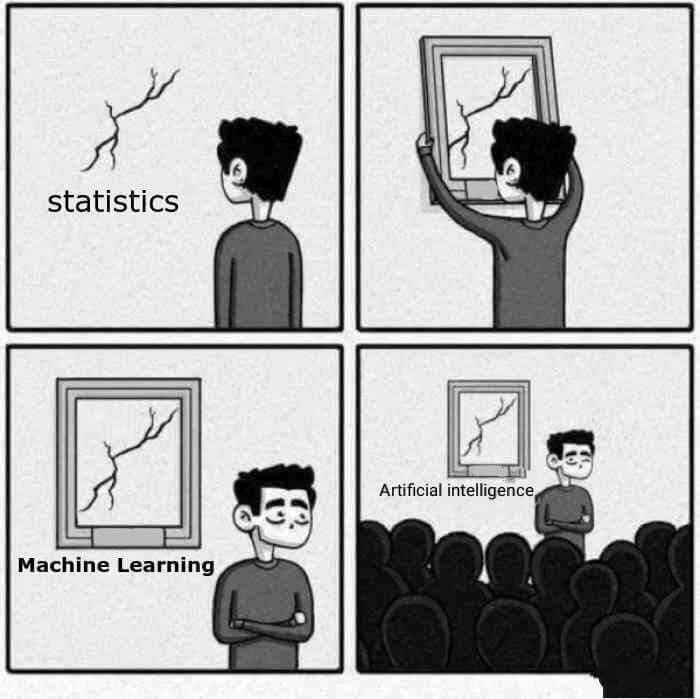
```

.center[Comic original de [sandserif](https://www.instagram.com/sandserifcomics/)]

Es un poco más complicado que eso.

---

# Aprendizaje automático

.pull-left[

Tipos:

  *   Aprendizaje supervisado

  *   Aprendizaje no supervisado

  *   Aprendizaje semi-supervisado

  *   Aprendizaje por refuerzo
]

---

# Aprendizaje automático

.pull-left[

Tipos

  *   **Aprendizaje supervisado**

  *   Aprendizaje no supervisado

  *   Aprendizaje semi-supervisado

  *   Aprendizaje por refuerzo
]

.pull-right[
```{r, out.width = "70%", fig.align='center', echo=FALSE, fig.alt = "aprendizaje supervisado: test de respuesta multiple"}

```

Imagen de [ivywise.com](https://www.ivywise.com/ivywise-knowledgebase/resources/article/spring-standardized-testing-advice-for-sophomores-and-juniors/)
]

---

# Aprendizaje automático

  *   **Aprendizaje supervisado**

```{r, out.width = "70%", fig.align='center', echo=FALSE, fig.alt = "figura del paper de Korpela"}
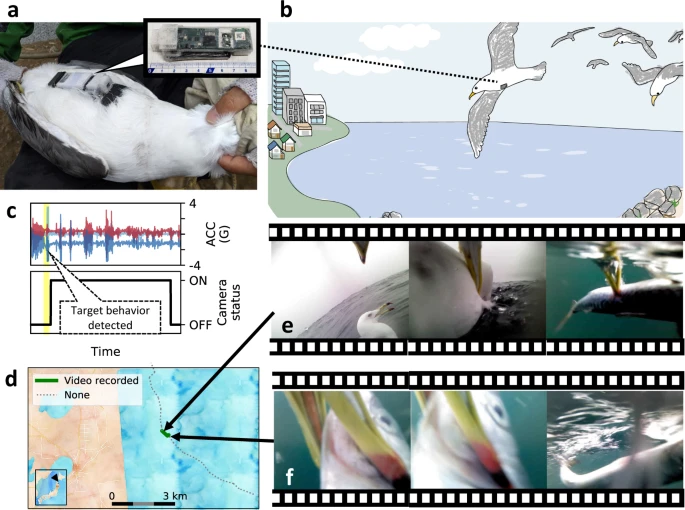
```

[Korpela et al. 2020](https://www.nature.com/articles/s42003-020-01356-8)


---

# Aprendizaje automático

  *   **Aprendizaje no supervisado**

```{r, out.width = "70%", fig.align='center', echo=FALSE, fig.alt = "aprendiza no supervisado"}
knitr::include_graphics("./img/unsupervised.png")
```

Imagen de [learn.g2.com](https://learn.g2.com/supervised-vs-unsupervised-learning)

---

# Aprendizaje automático

  *   **Aprendizaje no supervisado**

```{r, out.width = "60%", fig.align='center', echo=FALSE, fig.alt = "imagen del paper Joo et al 2014"}
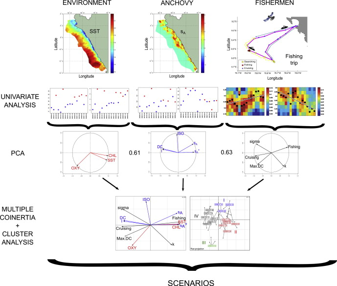
```

[Joo et al. 2014](https://www.sciencedirect.com/science/article/pii/S0079661114001323)

---

# Aprendizaje automático

  *   **Aprendizaje no supervisado**

```{r, out.width = "100%", fig.align='center', echo=FALSE, fig.alt = "imagen del paper Joo et al 2014"}
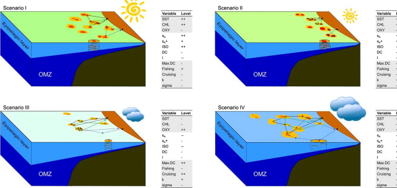
```

[Joo et al. 2014](https://www.sciencedirect.com/science/article/pii/S0079661114001323)


---

# Aprendizaje automático

  *   **Aprendizaje semi-supervisado**

```{r, out.width = "60%", fig.align='center', echo=FALSE, fig.alt = "aprendizaje semisupervisado"}
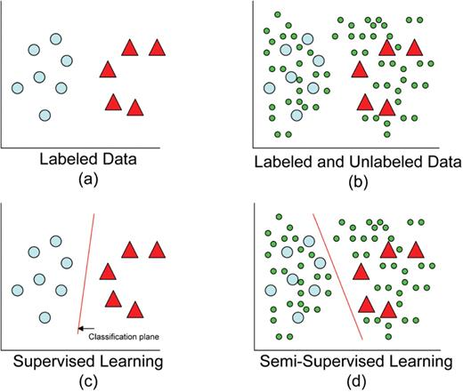
```

Imagen de [digitalvidya.com](https://www.digitalvidya.com/blog/semi-supervised-learning/)


---

# Aprendizaje automático

  *   **Aprendizaje semi-supervisado**

```{r, out.width = "55%", fig.align='center', echo=FALSE, fig.alt = "infografia del paper PNAS forced labor"}
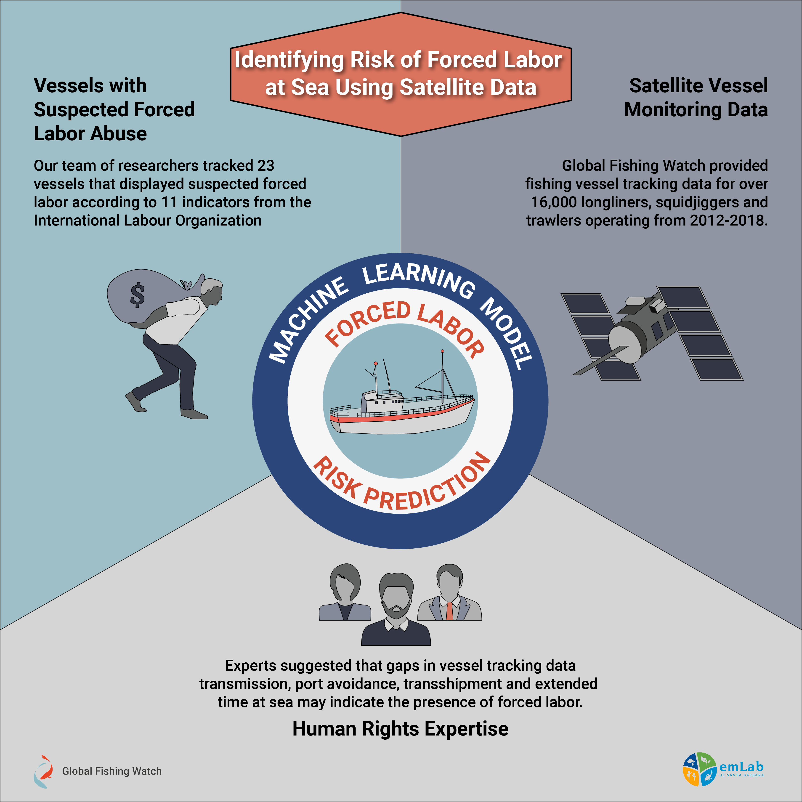
```

[McDonald et al. 2021](https://www.pnas.org/content/118/3/e2016238117)

---

# Aprendizaje automático

  *   **Aprendizaje por refuerzo**

```{r, out.width = "90%", fig.align='center', echo=FALSE, fig.alt = "reinforcement learning mario bros"}
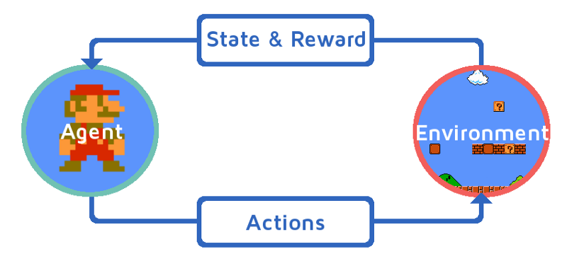
```

Imagen de [freecodecamp.com](https://www.freecodecamp.org/news/a-brief-introduction-to-reinforcement-learning-7799af5840db/)


---

# Aprendizaje automático

  *   **Aprendizaje por refuerzo**

```{r, out.width = "85%", fig.align='center', echo=FALSE, fig.alt = "fig de Lett 2008"}
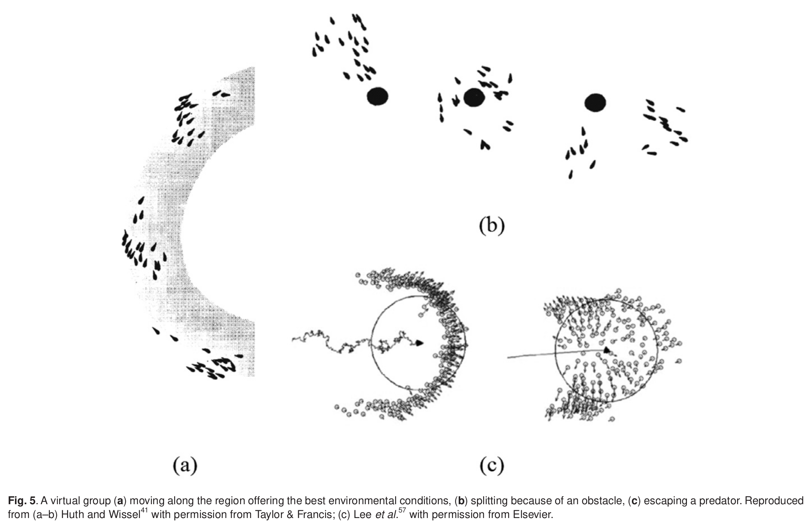
```

[Lett and Mirabet 2008](http://www.scielo.org.za/pdf/sajs/v104n5-6/a0910406.pdf)

---

# Aprendizaje supervisado: clasificación y regresión

--

Objetivo: Ajustar un modelo que relacione la variable respuesta con las variables predictoras.

  *   Clasificación:
    *   La variable respuesta es categórica (i.e. definida por un número finito de clases)
    *   El desempeño del modelo se mide contando clasificaciones correctas/incorrectas

    * Ejm. predicción de presencia de plantas invasivas a partir de distancia a caminos urbanos
    ([Cutler et al. 2007](https://pubmed.ncbi.nlm.nih.gov/18051647/))
    o identificar operaciones de pesca a partir de posiciones GPS de embarcaciones ([Joo et al. 2011](https://www.sciencedirect.com/science/article/pii/S0304380010004539?via%3Dihub))

---

# Aprendizaje supervisado: clasificación y regresión

  *   Regresión:
    *   La variable respuesta es continua (generalmente)
    *   El desempeño del modelo se mide sobre cuán lejano/cercano es el valor predicho respecto al real

    * Ejm. predicción de mortalidad de especies bentónicas en colonias utilizando temperatura
    ([Crisci et al. 2012](https://www.sciencedirect.com/science/article/pii/S0304380012001081?via%3Dihub))
    o del flujo de carbono en bosques a partir de diferentes condiciones climáticas espacio-temporales
    ([Liu et al. 2018](https://cdnsciencepub.com/doi/abs/10.1139/er-2018-0034))


---

# Aprendizaje supervisado: métodos

--

.pull-left[

Algunos de los métodos más comunes:

  * **Random forests o bosques aleatorios**

  * Neural networks o redes neuronales

  * Support vector machines o máquinas de vector soporte

]

.pull-right[
```{r, out.width = "100%", fig.align='center', echo=FALSE, fig.alt = "classif_tree"}
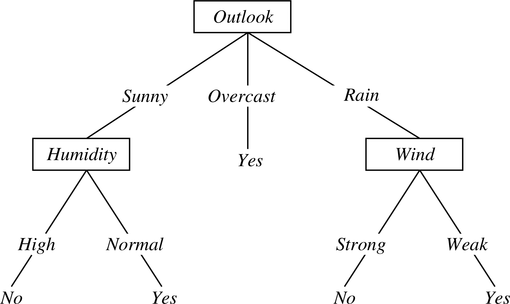
```
]

---

# Aprendizaje supervisado: métodos

.pull-left[

Algunos de los métodos más comunes:

  * Random forests o bosques aleatorios

  * **Neural networks o redes neuronales**

  * Support vector machines o máquinas de vector soporte

]

.pull-right[
```{r, out.width = "100%", fig.align='center', echo=FALSE, fig.alt = "ann"}
knitr::include_graphics("./img/ann.png")
```
]

---

# Aprendizaje supervisado: métodos

.pull-left[

Algunos de los métodos más comunes:

  * Random forests o bosques aleatorios

  * Neural networks o redes neuronales

  * **Support vector machines o máquinas de vector soporte**

]

.pull-right[
```{r, out.width = "100%", fig.align='center', echo=FALSE, fig.alt = "svm"}
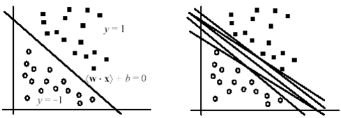
```
]

--

En las refs, artículos de revisión de aplicaciones.

---

# Aprendizaje supervisado: métodos

.pull-left[

Algunos de los métodos más comunes:

  * **Random forests o bosques aleatorios**

  * Neural networks o redes neuronales

  * Support vector machines o máquinas de vector soporte

]

---

# Aprendizaje supervisado: bosques aleatorios

```{r, out.width = "50%", fig.align='center', echo=FALSE, fig.alt = "rf as a set of trees"}
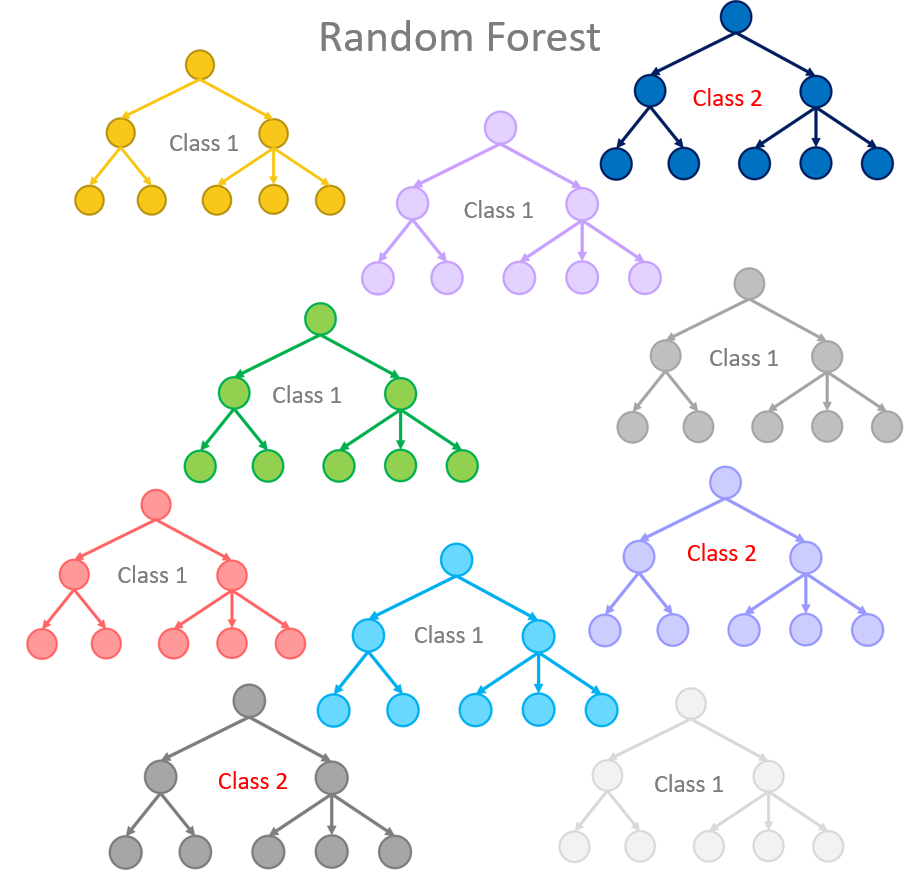
```

(Imagen de [dataversity.net](https://www.dataversity.net/from-a-single-decision-tree-to-a-random-forest/))

---

# Aprendizaje supervisado: árboles de decisión

```{r, out.width = "50%", fig.align='center', echo=FALSE, fig.alt = "decision tree"}
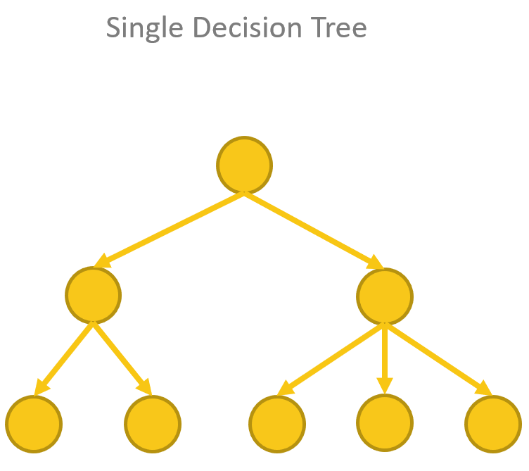
```


(Imagen de [dataversity.net](https://www.dataversity.net/from-a-single-decision-tree-to-a-random-forest/))

---

# Aprendizaje supervisado: árboles de decisión

Ejemplo de árbol de clasificación

```{r, out.width = "80%", fig.align='center', echo=FALSE, fig.alt = "classification tree example"}
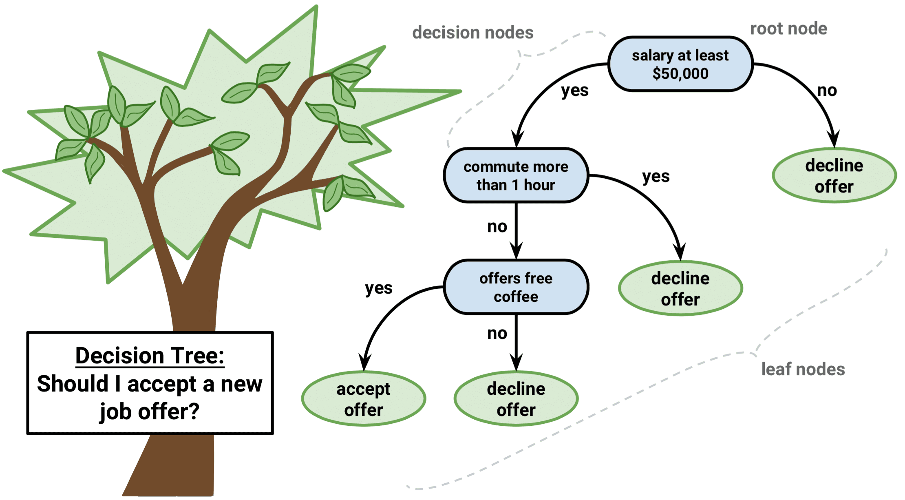
```

Imagen tomada de [medium](https://medium.datadriveninvestor.com/decision-trees-lesson-101-f00dad6cba21)

---

# Aprendizaje supervisado: árboles de decisión

Ejemplo de árbol de regresión

```{r, out.width = "39%", fig.align='center', echo=FALSE, fig.alt = "regression tree example"}
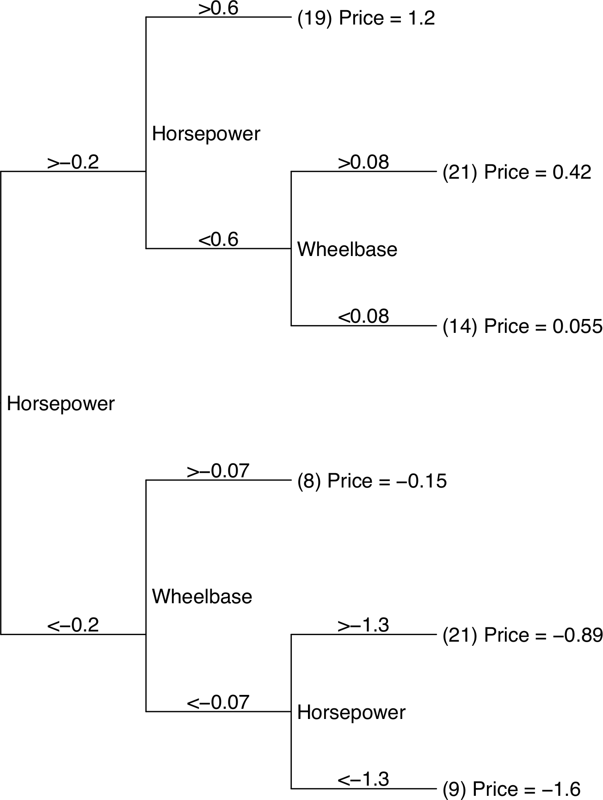
```


---

# Aprendizaje supervisado: árboles de decisión

.pull-left[

```{r, out.width = "100%", fig.align='center', echo=FALSE, fig.alt = "decision tree"}

```

]

--

.pull-right[

  Árboles de decisión:

  *   Modelo no lineal

]

---

# Aprendizaje supervisado: árboles de decisión

.pull-left[

```{r, out.width = "100%", fig.align='center', echo=FALSE, fig.alt = "decision tree"}

```

]


.pull-right[

  Árboles de decisión:

  *   Modelo no lineal

  *   Estructura tipo diagrama de flujo

]

---

# Aprendizaje supervisado: árboles de decisión

.pull-left[

```{r, out.width = "100%", fig.align='center', echo=FALSE, fig.alt = "decision tree"}

```

]


.pull-right[

  Árboles de decisión:

  *   Modelo no lineal

  *   Estructura tipo diagrama de flujo

  *   Compuesto de nodos y ramas

]

---

# Aprendizaje supervisado: árboles de decisión

.pull-left[

```{r, out.width = "100%", fig.align='center', echo=FALSE, fig.alt = "decision tree"}

```

]


.pull-right[

  Árboles de decisión:

  *   Modelo no lineal

  *   Estructura tipo diagrama de flujo

  *   Compuesto de nodos y ramas

  *   Usa reglas binarias en cada nodo para separar individuos en ramas

]


---

# Aprendizaje supervisado: árboles de decisión

.pull-left[

```{r, out.width = "100%", fig.align='center', echo=FALSE, fig.alt = "decision tree"}

```

]


.pull-right[

  Árboles de decisión:

  *   Modelo no lineal

  *   Estructura tipo diagrama de flujo

  *   Compuesto de nodos y ramas

  *   Usa reglas binarias en cada nodo para separar individuos en ramas

  *   Los nodos finales tienen una composición más homogénea respecto a la variable respuesta.

]

---

# Aprendizaje supervisado: árboles de decisión

.pull-left[

```{r, out.width = "100%", fig.align='center', echo=FALSE, fig.alt = "decision tree"}

```

]


.pull-right[

El modelo debe determinar:

  *   ¿Qué variable usar para partir en ramas?

  *   ¿Cuál es el valor del corte?

  *   ¿Cuándo parar de dividir en ramas?

  *   ¿Qué valor de la variable respuesta para nodos terminales?

]

---

# Aprendizaje supervisado: árboles de decisión

Parámetros que podemos definir:

  *   Criterio para particionar:

      En general, minimizando la impureza de los nodos.

      * En clasificación:

        * Coeficiente de Gini
        * Entropía

      * En regresión:

        * Diferencia de suma de cuadrados (del nodo padre respecto a los hijos)

---

# Aprendizaje supervisado: árboles de decisión

Parámetros que podemos definir:

  *   Gradiente de impureza

  *   Mínimo número de observaciones por nodo

  *   Profundidad máxima de los nodos terminales


--


¿Por qué los últimos dos?

```{r, out.width = "70%", fig.align='center', echo=FALSE, fig.alt = "overfitting"}
knitr::include_graphics("./img/overfitting.png")
```

---

# Aprendizaje supervisado: bosques aleatorios

.pull-left[

```{r, out.width = "100%", fig.align='center', echo=FALSE, fig.alt = "rf as a set of trees"}

```

]

---

# Aprendizaje supervisado: bosques aleatorios

.pull-left[

```{r, out.width = "100%", fig.align='center', echo=FALSE, fig.alt = "rf as a set of trees"}

```

]

.pull-right[

De árbol a bosque aleatorio:

]

---

# Aprendizaje supervisado: bosques aleatorios

.pull-left[

```{r, out.width = "100%", fig.align='center', echo=FALSE, fig.alt = "rf as a set of trees"}

```

]

.pull-right[

De árbol a bosque aleatorio:

  * Bosque compuesto por un conjunto de árboles

]

---

# Aprendizaje supervisado: bosques aleatorios

.pull-left[

```{r, out.width = "100%", fig.align='center', echo=FALSE, fig.alt = "rf as a set of trees"}

```

]

.pull-right[

De árbol a bosque aleatorio:

  * Bosque compuesto por un conjunto de árboles

  * Para cada árbol se usa un boostrap de los datos

]

---

# Aprendizaje supervisado: bosques aleatorios

.pull-left[

```{r, out.width = "100%", fig.align='center', echo=FALSE, fig.alt = "rf as a set of trees"}

```

]

.pull-right[

De árbol a bosque aleatorio:

  * Bosque compuesto por un conjunto de árboles

  * Para cada árbol se usa un boostrap de los datos

  * Para particionar en ramas se puede usar más de una variable a la vez

]


---

# Aprendizaje supervisado: bosques aleatorios

.pull-left[

```{r, out.width = "100%", fig.align='center', echo=FALSE, fig.alt = "rf as a set of trees"}

```

]

.pull-right[

De árbol a bosque aleatorio:

  * Bosque compuesto por un conjunto de árboles

  * Para cada árbol se usa un boostrap de los datos

  * Para particionar en ramas se puede usar más de una variable a la vez

  * Para la predicción final se promedia las predicciones de cada árbol

]


---

# Aprendizaje supervisado: bosques aleatorios

.pull-left[

```{r, out.width = "100%", fig.align='center', echo=FALSE, fig.alt = "rf as a set of trees"}

```

]

.pull-right[

Parámetros que podemos definir:

  * Número de árboles en el bosque

  * Número de variables a seleccionar para particionar desde cada nodo

  * Parámetros de árboles de decisión (e.g. criterio para particionar,
  tamaño de nodos, profundidad de nodos terminales)

]

---

# Aprendizaje supervisado: entrenamiento y test

Para medir la performance del modelo, utilizamos parte de los datos para entrenarlo (training), y otra parte para evaluarlo (test).

```{r, out.width = "100%", fig.align='center', echo=FALSE, fig.alt = "scheme: training and test"}
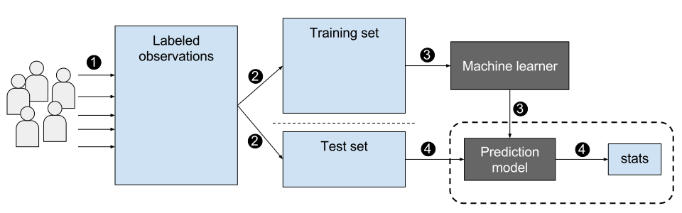
```

Imagen de [EpochFail en wikipedia](https://commons.wikimedia.org/wiki/File:Supervised_machine_learning_in_a_nutshell.svg)

---

# Aprendizaje supervisado: entrenamiento y test

Se pueden hacer múltiples y diferentes particiones en entrenamiento y test.

Ejm: K-fold validation

```{r, out.width = "55%", fig.align='center', echo=FALSE, fig.alt = "K-fold validation"}
knitr::include_graphics("./img/cv.png")
```

Imagen de [scikit-learn.org](https://scikit-learn.org/stable/modules/cross_validation.html)


---

# Aprendizaje supervisado: entrenamiento y test

Se pueden hacer múltiples y diferentes particiones en entrenamiento y test.

Ejm: Bootstrapping

```{r, out.width = "70%", fig.align='center', echo=FALSE, fig.alt = "Bootstrapping"}
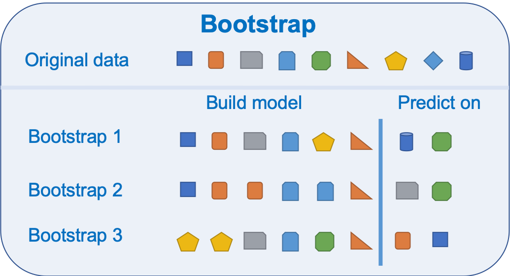
```

Imagen de [uwesterr.de](http://machinelearningintro.uwesterr.de/MlAlgoTrees.html)

---

# Aprendizaje supervisado: medidas de desempeño

Ya tenemos un plan para entrenar y evaluar el modelo.

¿Cómo evaluarlo? Métricas sobre los resultados de predicción.

--

En regresión:

* Raíz del error cuadrático medio

$$\sqrt{\sum_i^n{(\hat{y_i} - y_i)^2} /n}$$

* Error absoluto medio

$$\sum_i^n{|\hat{y_i} - {y_i}|} /n$$

---

# Aprendizaje supervisado: medidas de desempeño

En clasificación:

Asumiendo dos clases: condición positiva y negativa (e.g. covid). 

Matriz de confusión:

 | Real + | Real -
--------|--------|---------
Pred + | Positivos verdaderos (PV) | Positivos falsos (PF)
Pred - | Negativos falsos (NF) | Negativos verdaderos (NV)

--

* Accuracy o **Exactitud**: (de 0 a 1)

$$\frac{PV + NV}{PV + NF + PF + NV}$$ 

¿Cuánto corresponde lo predicho con lo real?

---

# Aprendizaje supervisado: medidas de desempeño

En clasificación:

Asumiendo dos clases: condición positiva y negativa (e.g. covid). 

Matriz de confusión:

 | Real + | Real -
--------|--------|---------
Pred + | Positivos verdaderos (PV) | Positivos falsos (PF)
Pred - | Negativos falsos (NF) | Negativos verdaderos (NV)


* Sensitivity/recall/hit rate/true positive rate o **Sensibilidad**: (de 0 a 1)

$$\frac{PV}{PV + NF}$$ 

De los positivos reales, ¿cuántos son correctamente predichos por el modelo?


---

# Aprendizaje supervisado: medidas de desempeño

En clasificación:

Asumiendo dos clases: condición positiva y negativa (e.g. covid). 

Matriz de confusión:

 | Real + | Real -
--------|--------|---------
Pred + | Positivos verdaderos (PV) | Positivos falsos (PF)
Pred - | Negativos falsos (NF) | Negativos verdaderos (NV)


* Specificity/selectivity/true negative rate o **Especificidad**: (de 0 a 1)

$$\frac{NV}{NV + PF}$$ 

De los negativos reales, ¿cuántos son correctamente predichos por el modelo?


---

# Aprendizaje supervisado: medidas de desempeño

En clasificación:

Asumiendo dos clases: condición positiva y negativa (e.g. covid). 

Matriz de confusión:

 | Real + | Real -
--------|--------|---------
Pred + | Positivos verdaderos (PV) | Positivos falsos (PF)
Pred - | Negativos falsos (NF) | Negativos verdaderos (NV)


* Precision/positive predictive value o **Precisión**: (de 0 a 1)

$$\frac{PV}{PV + PF}$$ 

De los positivos que predecimos, ¿cuántos son verdaderos?


---

# Aprendizaje supervisado: medidas de desempeño

En clasificación:

.pull-left[

* Exactitud $$\frac{PV + NV}{PV + NF + PF + NV}$$ 

* Sensibilidad $$\frac{PV}{PV + NF}$$ 

]

.pull-right[

* Especificidad $$\frac{NV}{NV + PF}$$ 

* Precisión $$\frac{PV}{PV + PF}$$ 

]

¿Cuál escoger? En la práctica, es difícil que todo sea perfecto.

---

# Aprendizaje supervisado: medidas de desempeño

En clasificación:

.pull-left[

* Exactitud $$\frac{PV + NV}{PV + NF + PF + NV}$$ 

* Sensibilidad $$\frac{PV}{PV + NF}$$ 

]

.pull-right[

* Especificidad $$\frac{NV}{NV + PF}$$ 

* Precisión $$\frac{PV}{PV + PF}$$ 

]

*   F1: media harmónica de precisión y sensibilidad

$$2 \times \frac{\text{Precision} \times \text{Sensibilidad}}{\text{Precision} + \text{Sensibilidad}} = \frac{2 \times PV}{2\times PV + PF + NF}$$

---

# Aprendizaje supervisado: medidas de desempeño

* AUC: Area under the curve o área bajo la curva ROC.

```{r, out.width = "40%", fig.align='center', echo=FALSE, fig.alt = "ROC space example"}
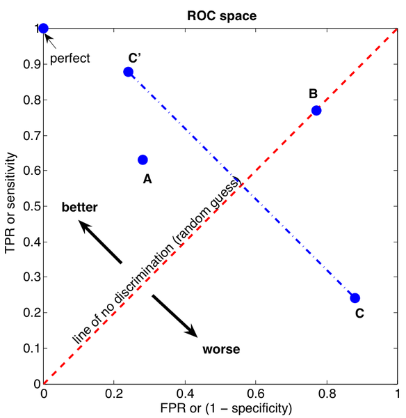
```    

Imagen de [Indon en wikipedia](https://commons.wikimedia.org/wiki/File:ROC_space.png)

---

# Aprendizaje supervisado: medidas de desempeño

* Utilizando umbrales de clasificación, se pueden construir curvas ROC

* El área bajo la curva se puede usar para comparar modelos

```{r, out.width = "48%", fig.align='center', echo=FALSE, fig.alt = "ROC curve example"}
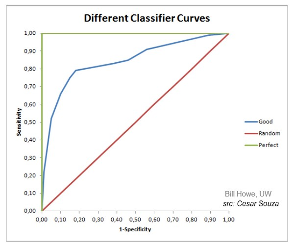
```    

Imagen de [datacadamia.com](https://datacadamia.com/_detail/data_mining/sensitivity_specificity_classifier_curves.jpg?id=data_mining%3Aroc)

---

# Aprendizaje supervisado: interpretando el modelo

--

Contribución de las variables al modelo o importancia de variables:

* La importancia de cada variable es calculada independientemente. 

--

* Una variable es importante si ignorándola se pierde en exactitud o en homogeneidad de los nodos terminales. 

--

* Para calcular la importancia de una variable por permutación, 
se compara la exactitud en la predicción 
entre el modelo ajustado de manera normal, y uno en el que los valores de la variable fueron permutados. 

---

# Aprendizaje supervisado: interpretando el modelo

Importancia de variables:

Ejemplo: prediciendo el valor monetario de jugadores FIFA.


```{r, out.width = "70%", fig.align='center', echo=FALSE, fig.alt = "Permutation importance FIFA example"}
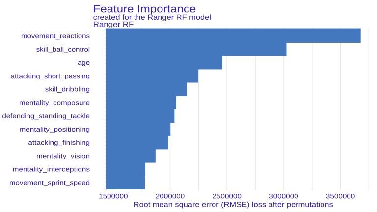
```    

Datos de [sofifa.com](https://sofifa.com/), cálculos e imagen de [DALEX](https://mlr3book.mlr-org.com/dalex.html)

---

# Aprendizaje supervisado: interpretando el modelo

La importancia no dice nada sobre la forma de la relación entre las variables predictoras y la variable a predecir. 

--

Gráfico de dependencia parcial:

* Muestra el efecto marginal de una variable predictora en la predicción,
asumiendo valores promedios de las otras.

* Puede mostrar si la relación es lineal, monotónica o más compleja. 

---

# Aprendizaje supervisado: interpretando el modelo

Gráfico de dependencia parcial del ejemplo FIFA

```{r, out.width = "80%", fig.align='center', echo=FALSE, fig.alt = "Parcial dependence plot FIFA example"}
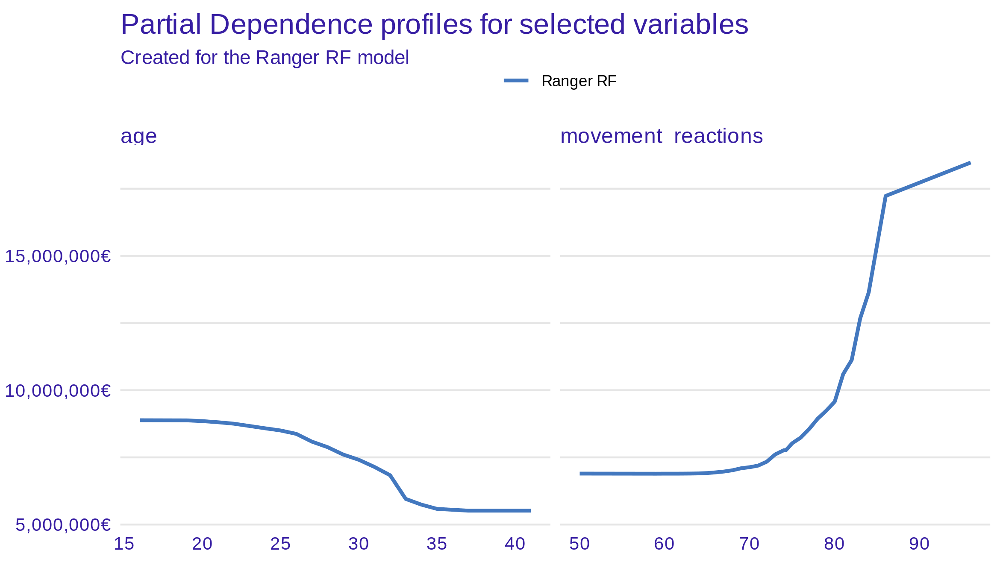
```    

Imagen de [DALEX](https://mlr3book.mlr-org.com/dalex.html)

---

# Aprendizaje automático en R

* Una visita al universo de [machine learning en R](https://cran.r-project.org/web/views/MachineLearning.html).

```{r, out.width = "80%", fig.align='center', echo=FALSE, fig.alt = "packages"}

```    


---

# Aprendizaje automático: ética

```{r, out.width = "100%", fig.align='center', echo=FALSE, fig.alt = "with great power comes great responsibility"}

```    

Imagen de [magicalquote.com](https://www.magicalquote.com/movie/spider-man/)

---

# Aprendizaje automático: ética

* El aprendizaje no puede ser tan automático

* Pensar en qué queremos lograr

* Cuáles son los sesgos de nuestros datos

* Qué variables tienen sentido

* Qué estamos optimizando

* Qué conclusiones estamos sacando

---

# Bibliografía

Para preparar esta unidad se utilizó:

* Curso ["A statistical view of deep learning in ecology"](https://www.stat.colostate.edu/~jah/talks_public_html/isec2020/index.html)
de Jennifer Hoeting, en virtual International Statistical Ecology Conference. Slides y video.

* Crisci, C., Ghattas, B., & Perera, G. (2012). 
[A review of supervised machine learning algorithms and their applications to ecological data.](https://doi.org/10.1016/j.ecolmodel.2012.03.001) 
Ecological Modelling, 240, 113–122. 

* [Sensitivity and specificity.](https://en.wikipedia.org/wiki/Sensitivity_and_specificity) Wikipedia page.

* Molnar (2021). [A guide for making black box models explainable.](https://christophm.github.io/interpretable-ml-book/) Book. 

---

# Bibliografía

Más recomendaciones:

* [Reinforcement Learning: Crash Course AI#9](https://www.youtube.com/watch?v=nIgIv4IfJ6s). Video.

* [Cross-validation](https://www.youtube.com/watch?v=7062skdX05Y). Video

* [Topics in data ethics](http://machinelearningintro.uwesterr.de/topics-in-data-ethics.html).

* Christin, S., Hervet, É., & Lecomte, N. (2019). 
[Applications for deep learning in ecology.](https://doi.org/10.1111/2041-210X.13256) 
Methods in Ecology and Evolution, 10(10), 1632–1644. 

* Cutler, D. R., Edwards, T. C., Beard, K. H., Cutler, A., Hess, K. T., Gibson, J., & Lawler, J. J. (2007). 
[Random forests for classification in ecology.](https://pubmed.ncbi.nlm.nih.gov/18051647/) Ecology, 88(11), 2783–2792.

---

# Bibliografía

Aún más:

* Lucas, T. C. D. (2020). 
[A translucent box: Interpretable machine learning in ecology.](https://doi.org/10.1002/ecm.1422) 
Ecological Monographs, 90(4), e01422. 

* Lum, K., & Isaac, W. (2016). 
[To predict and serve?](https://doi.org/10.1111/j.1740-9713.2016.00960.x) 
Significance, 13(5), 14–19. 

* Maksymiuk, S., Gosiewska, A., & Biecek, P. (2020). 
[Landscape of R packages for eXplainable Artificial Intelligence.](http://arxiv.org/abs/2009.13248) ArXiv:2009.13248 [Cs, Stat]. 

* Olden, J. D., Lawler, J. J., & Poff, N. L. (2008). [Machine learning methods without tears: A primer for ecologists.](https://pubmed.ncbi.nlm.nih.gov/18605534/) The Quarterly Review of Biology, 83(2), 171–193.


