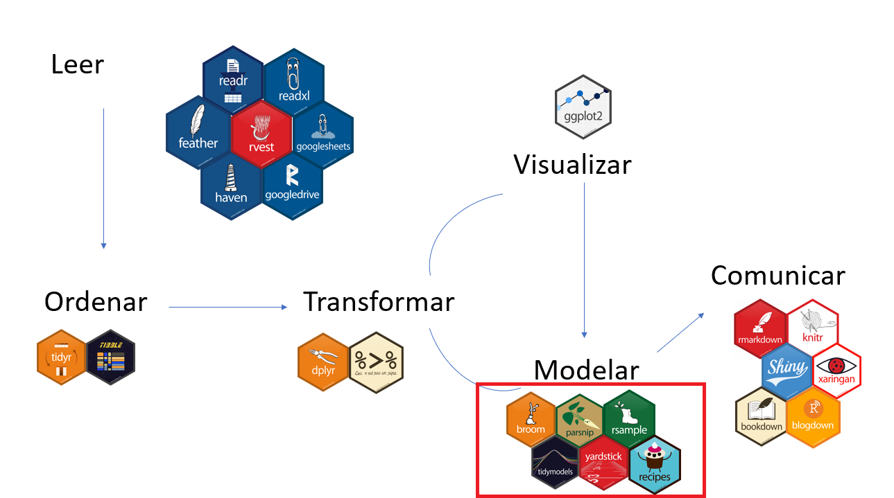

```{r setup, include=FALSE}
options(htmltools.dir.version = FALSE)
```

```{r xaringan-themer, include=FALSE, warning=FALSE}
library(xaringanthemer)
style_mono_accent(
  base_color = "#1c5253",
  header_font_google = google_font("Lato"),
  # text_font_google   = google_font("Montserrat", "300", "300i"),
  # code_font_google   = google_font("Fira Mono")
)
```


# Plan para este módulo

* Introducción a tidymodels

* Ajuste de un modelo de aprendizaje automático con tidymodels

* Calibración de hiperparámetros del modelo

* Gráficos para la interpretación del modelo

---

# ¿Qué es tidymodels?

--

Metapaquete para modelar de manera ordenada. 

--

tidy data --> datos ordenados

```{r, out.width = "80%", fig.align='center', echo=FALSE, fig.alt = "tidy data graph from Allison Horst"}

```

Artwork by @allison_horst

---

# ¿Qué es tidymodels?

```{r, out.width = "100%", fig.align='center', echo=FALSE, fig.alt = "esquema de tidy universe"}

```

Imagen de https://github.com/data-datum/curso-r-analisis-datos

---

# ¿Por qué tidymodels?

Las funciones de aprendizaje automático en R varían respecto al formato de los
datos de entrada, dependiendo del paquete a utilizar.

Ejm:

```{r, eval = FALSE}
  randomForest::randomForest(x = x, y = y, data = data)
```

```{r, eval = FALSE}
  ranger::ranger(y ~ x, data = data)
```

---

# ¿Por qué tidymodels?


.pull-left[

**Flujo de trabajo** consistente para:

* <span style = "color:grey">Dividir en sets de entrenamiento y test</span>

* <span style = "color:grey">Definir una "receta" para el pre-procesamiento de datos</span>

* <span style = "color:grey">Especificar el modelo</span>

* <span style = "color:grey">Calibrar los hiperparámetros</span>

* <span style = "color:grey">Evaluar y comparar modelos</span>

* <span style = "color:grey">Generar predicciones con el modelo final</span>

]


.pull-right[

```{r, out.width = "50%", fig.align='center', echo=FALSE, fig.alt="workflows hex"}
knitr::include_graphics("./img/workflows.png")
```

]

---

# ¿Por qué tidymodels?


.pull-left[

**Flujo de trabajo** consistente para:

* Dividir en sets de **entrenamiento** y **test**

* <span style = "color:grey">Definir una "receta" para el pre-procesamiento de datos</span>

* <span style = "color:grey">Especificar el modelo</span>

* <span style = "color:grey">Calibrar los hiperparámetros</span>

* <span style = "color:grey">Evaluar y comparar modelos</span>

* <span style = "color:grey">Generar predicciones con el modelo final</span>

]


.pull-right[

```{r, out.width = "50%", fig.align='center', echo=FALSE, fig.alt="rsample hex"}
knitr::include_graphics("./img/rsample.png")
```

]

---

# ¿Por qué tidymodels?


.pull-left[

**Flujo de trabajo** consistente para:

* Dividir en sets de **entrenamiento** y **test**

* Definir una "receta" para el **pre-procesamiento** de datos

* <span style = "color:grey">Especificar el modelo</span>

* <span style = "color:grey">Calibrar los hiperparámetros</span>

* <span style = "color:grey">Evaluar y comparar modelos</span>

* <span style = "color:grey">Generar predicciones con el modelo final</span>

]


.pull-right[

```{r, out.width = "50%", fig.align='center', echo=FALSE, fig.alt= "recipes hex"}
knitr::include_graphics("./img/recipes.png")
```

]

---

# ¿Por qué tidymodels?


.pull-left[

**Flujo de trabajo** consistente para:

* Dividir en sets de **entrenamiento** y **test**

* Definir una "receta" para el **pre-procesamiento** de datos

* Especificar el **modelo**

* <span style = "color:grey">Calibrar los hiperparámetros</span>

* <span style = "color:grey">Evaluar y comparar modelos</span>

* <span style = "color:grey">Generar predicciones con el modelo final</span>

]


.pull-right[

```{r, out.width = "50%", fig.align='center', echo=FALSE, fig.alt="parsnip hex"}
knitr::include_graphics("./img/parsnip.png")
```

]

---

# ¿Por qué tidymodels?


.pull-left[

**Flujo de trabajo** consistente para:

* Dividir en sets de **entrenamiento** y **test**

* Definir una "receta" para el **pre-procesamiento** de datos

* Especificar el **modelo**

* **Calibrar** los hiperparámetros

* <span style = "color:grey">Evaluar y comparar modelos</span>

* <span style = "color:grey">Generar predicciones con el modelo final</span>

]


.pull-right[

```{r, out.width = "50%", fig.align='center', echo=FALSE, fig.alt="tune hex"}
knitr::include_graphics("./img/tune.png")
```

]

---

# ¿Por qué tidymodels?


.pull-left[

**Flujo de trabajo** consistente para:

* Dividir en sets de **entrenamiento** y **test**

* Definir una "receta" para el **pre-procesamiento** de datos

* Especificar el **modelo**

* **Calibrar** los hiperparámetros

* **Evaluar** y comparar modelos

* <span style = "color:grey">Generar predicciones con el modelo final</span>

]


.pull-right[

```{r, out.width = "50%", fig.align='center', echo=FALSE, fig.alt="yardstick hex"}

```

]


---

# ¿Por qué tidymodels?


.pull-left[

**Flujo de trabajo** consistente para:

* Dividir en sets de **entrenamiento** y **test**

* Definir una "receta" para el **pre-procesamiento** de datos

* Especificar el **modelo**

* **Calibrar** los hiperparámetros

* **Evaluar** y comparar modelos

* Generar **predicciones** con el modelo final

]


.pull-right[

```{r, out.width = "50%", fig.align='center', echo=FALSE, fig.alt="workflows hex"}
knitr::include_graphics("./img/workflows.png")
```

]

---


# Primer caso:  

# Ajustando un modelo de aprendizaje automático y predecir con `tidymodels`.

--

  * Ejercicio de clasificación
  * Bosques aleatorios
  * Entrenamiento y test
  * Parametrización por defecto
  * Flujo de trabajo simple
  * Matriz de confusión
  

---

# Los datos

Imaginemos que queremos crear un modelo para predecir **especie** de pingüinos en
la Antártida en base a su morfología u otras variables disponibles.


```{r penguin-data}
library(datos)
pinguinos
```

---

# Explorando los datos


```{r, message=FALSE, warning=FALSE}
summary(pinguinos)
```


---

# Explorando los datos

```{r, message=FALSE, warning=FALSE}
library(magrittr) #pipes
library(tidyr) #drop_na
pinguinos <- pinguinos %>% 
  drop_na()

summary(pinguinos)
```

 
---

# Explorando los datos


```{r, message=FALSE, warning=FALSE, fig.height = 5}
library(ggplot2)
pinguinos %>% 
  ggplot(aes(x = largo_pico_mm, y = largo_aleta_mm, color = especie)) +
  geom_point() +
  theme_classic()
```

---

# Explorando los datos


```{r, message=FALSE, warning=FALSE}
library(dplyr)
pinguinos %>% 
  select(-especie, -isla, -sexo, -anio) %>% 
  cor(use = "pairwise.complete.obs") %>% 
  round(digits = 2)
```
---

# Explorando los datos


```{r, message=FALSE, warning=FALSE}
library(GGally)
ggpairs(pinguinos)
```


---

# Dividiendo entre datos de entrenamiento y test

Usamos el paquete `rsample`

```{r}
library(rsample)

set.seed(4563) # for traceability
pinguinos_div <- initial_split(data = pinguinos, prop = 0.75)
pinguinos_div
```


```{r}
pinguinos_entren <- training(pinguinos_div)
pinguinos_test <- testing(pinguinos_div)
```

---

# Especificando el modelo

En general, hay que especificar: 

* El tipo de modelo
* El modo (clasificación o regresión)
* El motor ("engine") o paquete


El [motor de búsqueda de tidymodels](https://www.tidymodels.org/find/parsnip/) 
ofrece muchas opciones. 

Digamos que usaremos bosques aleatorios.

--

* El tipo de modelo es `rand_forest`

* El modo es `classification`

* El motor que usaremos es `ranger`

---

# Especificando el modelo

```{r}
library(parsnip)
rf_espec <- 
  # tipo de modelo
  rand_forest() %>% 
  # modo
  set_mode("classification") %>% 
  # motor
  set_engine("ranger")

rf_espec
  
```

---

# Creando una receta de pre-procesamiento

```{r, out.width = "90%", fig.align='center', echo=FALSE, fig.alt="Allison Horst's graph of the recipes package"}
knitr::include_graphics("./img/recipes_AH.png")
```

Artwork by @allison_horst

---

# Creando una receta de pre-procesamiento

```{r, warning=FALSE, message=FALSE}
library(recipes)
receta <- recipe(especie ~ ., # modelar especie usando todas las otras variables
                 data = pinguinos) %>% 
  # cambié de opinión respecto a anio 
  update_role(anio, new_role = "no usar") %>% 
  # remover variables con correlaciones > 0.8
  step_corr(all_predictors() & all_numeric(), threshold = 0.8) 

summary(receta)
```


---

# Armando el flujo de trabajo

```{r}
library(workflows)
# generando el flujo de trabajo con workflow
rf_flujo <- workflow() %>% 
  # añadir la receta
  add_recipe(receta) %>% 
  # añadir las especificaciones del modelo
  add_model(rf_espec)
```

---

# Armando el flujo de trabajo

```{r}
rf_flujo 
```

---

# Aplicando la receta y ajustando el modelo a los datos 

```{r, message=FALSE, warning=FALSE}
rf_ajuste <- fit(object = rf_flujo, 
                 data = pinguinos_entren)
```

---

<!-- # Aplicando la receta y ajustando el modelo a los datos  -->

```{r, echo = FALSE}
rf_ajuste
```

---

# Prediciendo sobre los datos de test

```{r}
predict(object = rf_ajuste, 
        new_data = pinguinos_test)
```

---

# Prediciendo sobre los datos de test

```{r}
(predict(object = rf_ajuste, 
        new_data = pinguinos_test) %>% 
  transmute(pred = .pred_class,
            real = pinguinos_test$especie) -> pinguinos_test_pred)
```

---

# Calculando la matriz de confusión

```{r, message=FALSE, warning=FALSE}
library(yardstick)
pinguinos_test_pred %>% 
  conf_mat(truth = real, estimate = pred,
           dnn = c("Predicción", "Real"))

```
Resultado perfecto.


---


# Segundo caso:  

# Calibrando los hiperparámetros del modelo.

--

  * Ejercicio de clasificación
  * Bosques aleatorios
  * Remuestreo en el set de entrenamiento
  * Calibración de hiperparámetros
  * Matriz de confusión e indicadores

---

Ahora buscaremos predecir el sexo de los pingüinos a partir morfológicos y otros.

--

# Cambiando la receta

```{r}
receta2 <- recipe(sexo ~ .,
                  data = pinguinos) %>% 
  update_role(anio, new_role = "no usar") %>% 
  update_role(isla, new_role = "no usar") %>% 
  step_corr(all_predictors() & all_numeric(), threshold = 0.8)
```

---

# Especificando el modelo

Esta vez, especificando los hiperparámetros a calibrar para el tipo de modelo. 

Los hiperparámetros a especificar se pueden ver con 

```{r}
show_model_info("rand_forest")
```

---

# Especificando el modelo

```{r}
library(tune)
rf_espec2 <- rand_forest(
  mtry = tune(), # número de predictores a usar en cada división
  min_n = tune() # número de observaciones necesarias para seguir dividiendo en nodos
) %>% 
  set_mode("classification") %>% 
  set_engine("ranger")

```

---

# Entrenamiento y test

Usamos las particiones anteriores `pinguinos_entren` y `pinguinos_test` a partir
de `pinguinos_div`.

--

```{r}
pinguinos_div

```

--

* Esta vez no nos conformaremos con una sola división en entrenamiento y test
para probar modelos con parametrizaciones distintas.

* Haremos bootstrapping de los datos de entrenamiento para calibrar hiperparámetros

* Luego haremos la evaluación final del modelo sobre los datos de test.


---

# Entrenamiento y test

```{r}
set.seed(8723)
pinguinos_boot <- bootstraps(pinguinos_entren, strata = sexo)
pinguinos_boot
```

---

# Armando el flujo de trabajo

```{r}
rf_flujo2 <- workflow() %>% 
  add_recipe(receta2) %>% 
  add_model(rf_espec2)
```

---

# Armando el flujo de trabajo

```{r}
rf_flujo2
```

---

# Calibrando hiperparámetros

  * Haremos cálculo en paralelo para optimizar procesos (opcional).
  
  * Si no tenemos idea de los valores a probar, fijamos un número de valores y 
  el algoritmo internamente los fija

```{r, message=FALSE, warning=FALSE}
library(parallel)
all_cores <- parallel::detectCores(logical = FALSE) # paralelo
cl <- makePSOCKcluster(all_cores-3)  # paralelo
doParallel::registerDoParallel(cl) # paralelo

set.seed(345)
calibrar_res <- tune_grid(
  rf_flujo2,
  resamples = pinguinos_boot,
  grid = 10 # 10 combinaciones de valores de hiperparámetros
)

stopCluster(cl) # paralelo
```

---

# Calibrando hiperparámetros

Veamos los valores probados y sus resultados respecto a la exactitud (*accuracy*)

```{r}
calibrar_res %>% 
  collect_metrics() 
```

---

# Calibrando hiperparámetros

Veamos los valores probados y sus resultados respecto a la exactitud (*accuracy*)

```{r}
calibrar_res %>% 
  collect_metrics() %>% 
  filter(.metric == "accuracy") 
```

---

# Calibrando hiperparámetros

Veamos los valores probados y sus resultados respecto a la exactitud (*accuracy*)

```{r}
calibrar_res %>% 
  collect_metrics() %>% 
  filter(.metric == "accuracy") %>% 
  select(mtry, min_n, mean)
```

---

# Calibrando hiperparámetros

Veamos los valores probados y sus resultados respecto a la exactitud (*accuracy*)

```{r}
calibrar_res %>% 
  collect_metrics() %>% 
  filter(.metric == "accuracy") %>% 
  select(mtry, min_n, mean) %>% 
  pivot_longer(mtry:min_n,
               values_to = "valor",
               names_to = "hiperparámetro")
```

---

# Calibrando hiperparámetros

Veamos los valores probados y sus resultados respecto a la exactitud (*accuracy*)

```{r, eval = FALSE}
calibrar_res %>% 
  collect_metrics() %>% 
  filter(.metric == "accuracy") %>% 
  select(mtry, min_n, mean) %>% 
  pivot_longer(mtry:min_n,
               values_to = "valor",
               names_to = "hiperparametro") %>% 
  ggplot(aes(x = valor, y = mean)) +
  geom_point(show.legend = FALSE) + 
  ylab("exactitud") +
  facet_wrap(~hiperparametro, scales = "free_x") +
  theme_light()
```
---

# Calibrando hiperparámetros

```{r, echo = FALSE, fig.width= 8}
calibrar_res %>% 
  collect_metrics() %>% 
  filter(.metric == "accuracy") %>% 
  select(mtry, min_n, mean) %>% 
  pivot_longer(mtry:min_n,
               values_to = "valor",
               names_to = "hiperparametro") %>% 
  ggplot(aes(x = valor, y = mean)) +
  geom_point(show.legend = FALSE) + 
  ylab("exactitud") +
  facet_wrap(~hiperparametro, scales = "free_x") +
  theme_light()
```

---

# Calibrando hiperparámetros

A partir de estos resultados podemos hacer una búsqueda de combinaciones de 
valores más sistemática.

```{r}
grilla <- expand.grid(
  mtry = c(1,2),
  min_n = seq(from = 10, to = 40, by=5)
)

grilla
```

---

# Calibrando hiperparámetros

Y calibramos otra vez

```{r, message=FALSE, warning=FALSE}
cl <- makePSOCKcluster(all_cores-3)  # paralelo
doParallel::registerDoParallel(cl) # paralelo

set.seed(543)
calibrar2_res <- tune_grid(
  rf_flujo2,
  resamples = pinguinos_boot,
  grid = grilla
)

stopCluster(cl) # paralelo
```

---

# Calibrando hiperparámetros

Veamos los resultados

```{r}
calibrar2_res %>% 
  collect_metrics %>% 
  filter(.metric == "accuracy") 
```

---

# Calibrando hiperparámetros

Veamos los resultados

```{r}
calibrar2_res %>% 
  collect_metrics %>% 
  filter(.metric == "accuracy") %>% 
  select(mtry, min_n, mean, std_err)
```

---

# Calibrando hiperparámetros

Veamos los resultados

```{r, eval = FALSE}
calibrar2_res %>% 
  collect_metrics %>% 
  filter(.metric == "accuracy") %>% 
  select(mtry, min_n, mean, std_err) %>% 
  mutate(min_n = factor(min_n)) %>% 
  ggplot(aes(x = mtry, y = mean, color = min_n)) +
  geom_line() +
  geom_point() +
  ylab("exactitud") +
  scale_color_brewer(type = "qual", palette = "Set1" ) +
  theme_bw()

```

---

# Calibrando hiperparámetros

Veamos los resultados

.pull-left[
```{r, echo = FALSE, height = 5.5}
calibrar2_res %>% 
  collect_metrics %>% 
  filter(.metric == "accuracy") %>% 
  select(mtry, min_n, mean, std_err) %>% 
  mutate(min_n = factor(min_n)) %>% 
  ggplot(aes(x = mtry, y = mean, color = min_n)) +
  geom_line() +
  geom_point() +
  ylab("exactitud") +
  scale_color_brewer(type = "qual", palette = "Set1" ) +
  theme_bw()

```
]

--

.pull-right[
Es obvio que mtry=1 da mejores resultados. No hay mucha diferencia en min_n;
nos quedamos con min_n=20.
]

---

# Actualizando las especificaciones del modelo

Lo podemos hacer directamente en nuestro flujo de trabajo

```{r, eval = FALSE}
rf_flujo2_cal <- finalize_workflow(
  x = rf_flujo2,
  parameters = list(mtry = 1, min_n = 20) # select_best(calibrar_res, "accuracy")
)

rf_flujo2_cal
```
---

# Actualizando las especificaciones del modelo

```{r, echo = FALSE}
rf_flujo2_cal <- finalize_workflow(
  x = rf_flujo2,
  parameters = list(mtry = 1, min_n = 20) # select_best(calibrar_res, "accuracy") 
)

rf_flujo2_cal
```

---

# Ajustando a los datos y prediciendo

```{r}

rf_ajuste2_cal <- rf_flujo2_cal %>% 
  fit(data = pinguinos_entren)

predict(object = rf_ajuste2_cal, new_data =  pinguinos_test) %>% 
  transmute(pred = .pred_class,
            real = pinguinos_test$sexo) -> pinguinos_sex_pred
```

---

# Calculando la matriz de confusión e indicadores

```{r}
pinguinos_sex_pred %>% 
conf_mat(truth = real, estimate = pred, 
         dnn = c("Predicción", "Real"))
```

--

```{r}
multi_metric <- metric_set(accuracy, recall, precision)
multi_metric(data = pinguinos_sex_pred, truth = real, estimate = pred)

```

---

# Tercer caso:

# Interpretando el modelo

  * Ejercicio de clasificación
  * Bosques aleatorios
  * Hiperparametrización anterior
  * Importancia de variables
  * Dependencia parcial

---

# Especificando el modelo

Cuando nos interesa la interpretación, es mejor pedir el cálculo de 
la importancia al especificar el modelo. 

Ahora usaremos los valores de hiperparámetros del caso anterior.

--

```{r}
rf_espec3 <- rand_forest() %>% 
  set_args(mtry = 1,
           min_n = 20) %>% 
  set_mode("classification") %>% 
  set_engine("ranger", importance = "permutation")

rf_flujo3 <- workflow() %>% 
  add_recipe(receta2) %>% 
  add_model(rf_espec3)
```

Esta vez ajustamos a todos los datos

```{r}
rf_ajuste3 <- fit(object = rf_flujo3,
                  data = pinguinos)
```
---

# Graficando la importancia

Extraemos el modelo

```{r}
modelo_ajustado <- rf_ajuste3 %>%  
  pull_workflow_fit()
```

Y de él, la importancia de variables

```{r, message=FALSE, warning=FALSE}
library(vip)
(importancia <- vi(modelo_ajustado))
```

---

# Graficando la importancia

```{r, message=FALSE, warning=FALSE, fig.height=4.5}
importancia %>%
  mutate(Variable = factor(Variable, 
                           levels = Variable[order(Importance)])) %>% 
  ggplot(aes(y = Variable, x = Importance)) +
  geom_point() +
  theme_bw()
```

---

# Graficando la dependencia parcial

Primero creamos una función para especificar 
* qué objeto se usa para predecir
* sobre qué datos
* qué clase de predicción
* y cómo se llama la columna de predicción

Es necesario para la función `partial`

```{r, message=FALSE, warning=FALSE}
library(pdp)

pdp_pred_fun <- function(object, newdata) {
  predict(object, newdata, type = "class")$.pred_class
}
```

---

# Graficando la dependencia parcial

```{r, message=FALSE, warning=FALSE, fig.height=4}             
partial(rf_ajuste3,
          pred.var = "masa_corporal_g",
          pred.fun = pdp_pred_fun,
          train = pinguinos, center = FALSE) %>% 
plotPartial(rug = FALSE, center = FALSE, levelplot = FALSE, 
            alpha = 0, pdp.col = "#1f78b4")
```

---

# Graficando la dependencia parcial

```{r, message=FALSE, warning=FALSE, fig.height=4}             
partial(rf_ajuste3,
          pred.var = "alto_pico_mm",
          pred.fun = pdp_pred_fun,
          train = pinguinos, center = FALSE) %>% 
plotPartial(rug = FALSE, center = FALSE, levelplot = FALSE, 
            alpha = 0, pdp.col = "#1f78b4")
```

---

# Graficando la dependencia parcial

```{r, message=FALSE, warning=FALSE, fig.height=4}             
partial(rf_ajuste3,
          pred.var = "largo_pico_mm",
          pred.fun = pdp_pred_fun,
          train = pinguinos, center = FALSE) %>% 
plotPartial(rug = FALSE, center = FALSE, levelplot = FALSE, 
            alpha = 0, pdp.col = "#1f78b4")
```


---

# Bibliografía

Para preparar esta unidad se utilizó:


---

# Ejercicio de aplicación


<!-- library(vip) -->
<!-- rf_ajuste2 %>%  -->
<!--   vip(geom = "point") -->

<!-- ```{r} -->
<!-- (mejor_exac <- select_best(calibrar_res, "accuracy")) -->
<!-- ``` -->


<!-- ```{r, message=FALSE, warning=FALSE} -->
<!-- library(tune) -->
<!-- rf_ajuste <- fit_resamples(object = rf_flujo,  -->
<!--                            resamples = pinguinos_boot, -->
<!--                            control = control_resamples(save_pred = TRUE)) -->
<!-- ``` -->


<!-- ```{r} -->
<!-- collect_metrics(rf_ajuste) -->
<!-- conf_mat_resampled(rf_ajuste) -->

<!-- rf_ajuste %>%  -->
<!--   collect_predictions() %>%  -->
<!--   group_by(id) %>%  -->
<!--   precision(truth = especie,  -->
<!--          estimate = .pred_class, -->
<!--          event_level = "third") %>%  -->
<!--   summarize(mean(.estimate)) -->
<!-- ``` -->

<!-- # Aplicando la receta y ajustando el modelo a los datos  -->

<!-- ```{r} -->
<!-- rf_ajuste %>%  collect_predictions() -->
<!-- ``` -->

<!-- --- -->


<!-- --- -->

<!-- # Preparando los ingredientes -->

<!-- ```{r} -->
<!-- (pinguinos_prep <- receta %>%  -->
<!--   prep(pinguinos_entren)) -->
<!-- ``` -->

<!-- --- -->

<!-- # Horneando los datos -->

<!-- ```{r} -->
<!-- (pinguinos_cocidos <- bake(pinguinos_prep, new_data = NULL)) -->
<!-- ``` -->
